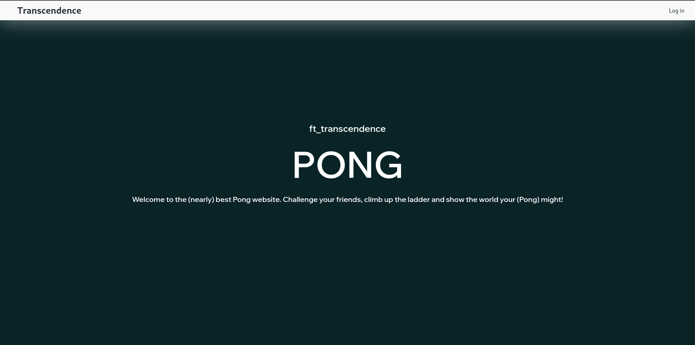
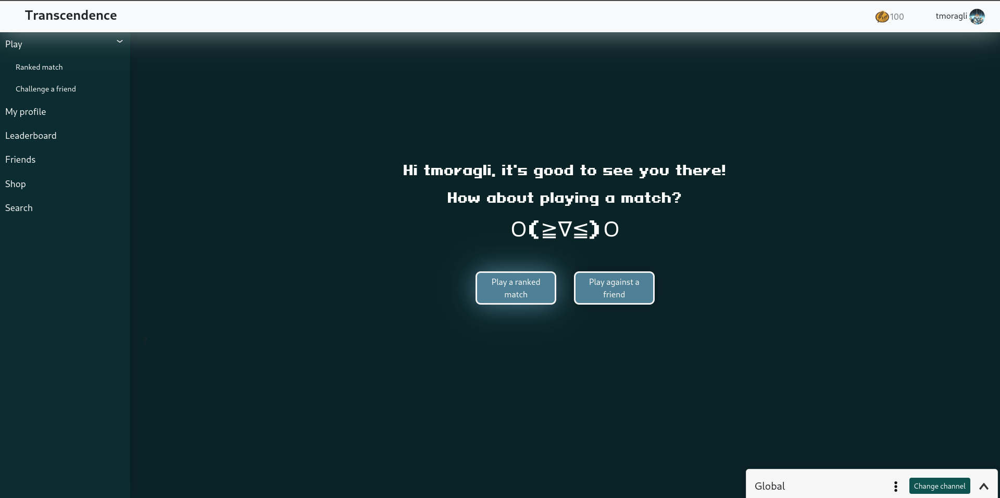
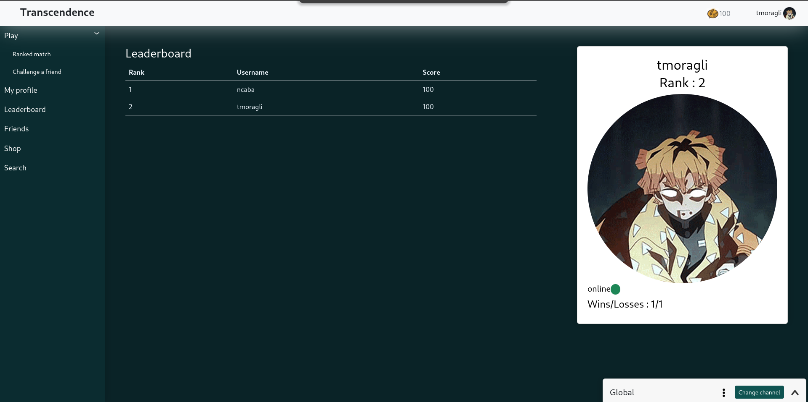
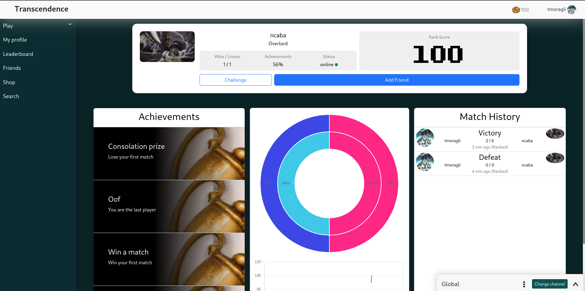
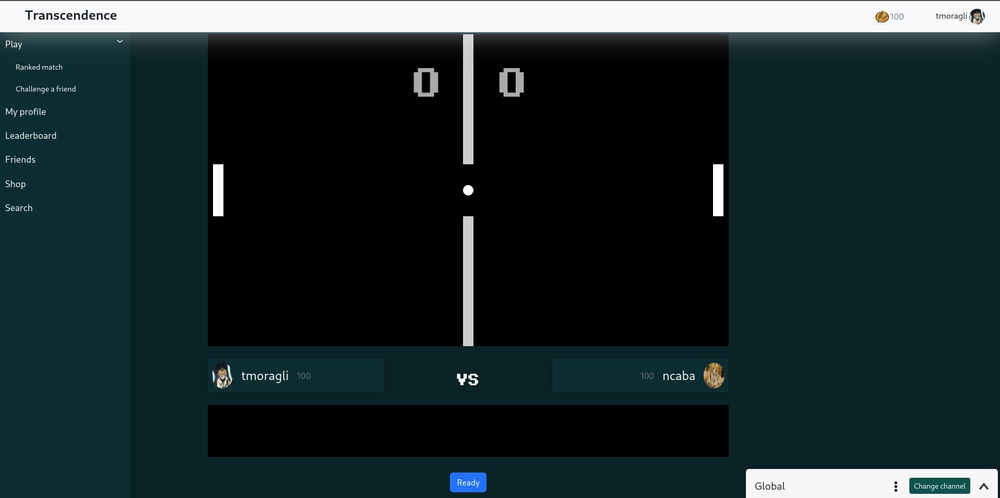
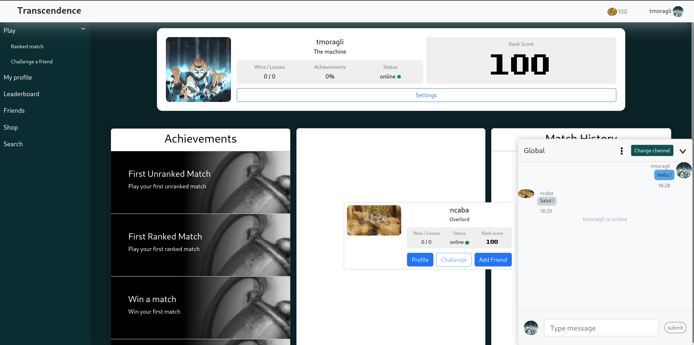

# Multiplayer Pong

This project is an introduction full stack web developpement,
The objective is to build a web application with a Postgresql database, NestJS framework based Back-End server and a Angular framework based Front-End server with Nginx.

This project cannot be used by anyone, because you would need a specific env that contains confidential information, such as your own 42 API keys, and mailgun credentials.
If you do have all the above consider adding an .env file at the root of the Backend folder, and a .env file at the root of the repo like the examples given in the project.

# However, here are some images:

# Contributors:
[Shazway](https://github.com/Shazway)
[Nathan Caba](https://github.com/NeoWaffleSpy)
[Mdelwaul]()
